<div align="center">


# Vantagraph

**A modern, modular Spicetify theme for Spotify.**
11 hand-tuned color schemes, an in-app settings panel, custom icon set, picture-in-picture lyric karaoke, taskbar player, scroll-wheel volume, and a per-track loop tool - all in one drop-in theme.

[](./LICENSE)
[](https://spicetify.app/)
[](https://www.spotify.com/)
[](#)
[](https://github.com/Miabeyefendi)

[**Install**](#-installation) · [**Themes**](#-the-eleven-themes) · [**Extensions**](#-extensions) · [**Settings**](#%EF%B8%8F-settings-tour) · [**Credits**](#-credits--inspiration) · **·** [Türkçe](./README_TR.md) · [Español](./README_ES.md)

</div>

---

<div align="center">

### Dark themes at a glance

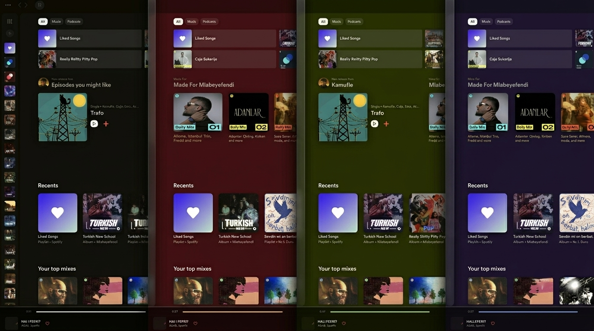

### Light themes at a glance

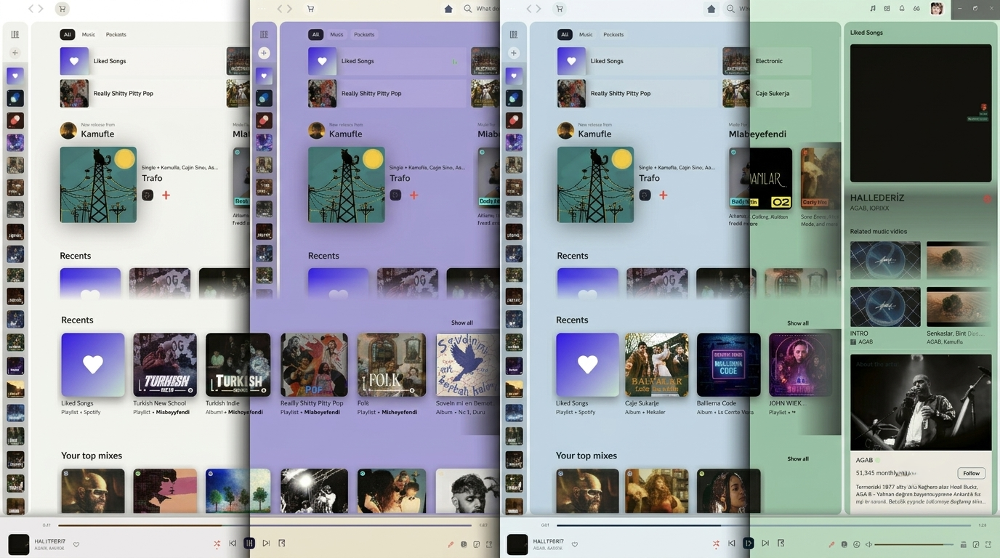

</div>

---

## ✨ Highlights

- **11 carefully balanced palettes** - 5 dark + 6 light, each tuned for long listening sessions.
- **In-app settings panel** - 5-tab modal that lives inside Spotify (Theme, Font, Layout, Background, Snippets).
- **Custom Vantagraph icon set** - 66 hand-drawn SVGs that replace Spotify's Encore icons across topbar, sidebar, player, and context menus.
- **Vantagraph Lyric Miniplayer** - picture-in-picture window with word-synced karaoke, translations, vinyl, animation presets.
- **Vantagraph Taskbar Player** - borderless, always-on-top floating bar via `documentPictureInPicture`. Lets you control playback while another app is in fullscreen.
- **Volume+** - scroll wheel volume on the bar, middle-click mute, percentage tooltip, quick presets, mute-state visual.
- **LoopyLoop** - right-click the progress bar to set start/end points; loops persist per track in localStorage.
- **30+ snippets** - hide friends activity, ads banner, "Made for You", "Top Mixes", podcasts filter, etc. Plus rounded images, modern scrollbar, thin library rows, auto-hide sidebar, and a stack of developer tools (layout grid, element highlighter, spacing visualizer, CSS variable monitor, DOM mutation logger).
- **Custom backgrounds** - any image URL, or use the current album cover, with live blur / brightness / contrast / saturation sliders.
- **Custom font & accent** - any Google Font (or local), any HEX accent color.
- **One-click reset** - wipes every localStorage key, injected style, body class, and inline variable.

---

## 🎨 The eleven themes

### Dark

<table>
<tr>
  <td align="center" width="50%">
    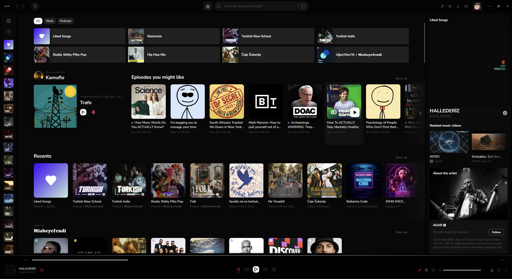<br/>
    <sub><b>VantaBlack</b> · void-deep neutrals, off-white type</sub>
  </td>
  <td align="center" width="50%">
    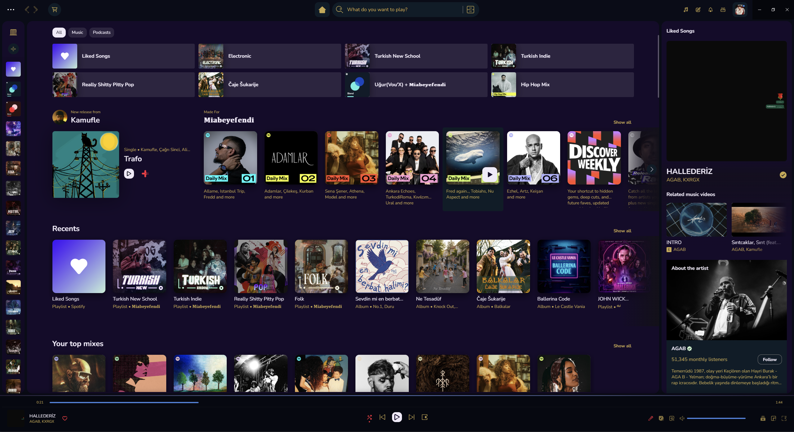<br/>
    <sub><b>R34 Purple</b> · midnight indigo, gold accents, royal blue play</sub>
  </td>
</tr>
<tr>
  <td align="center">
    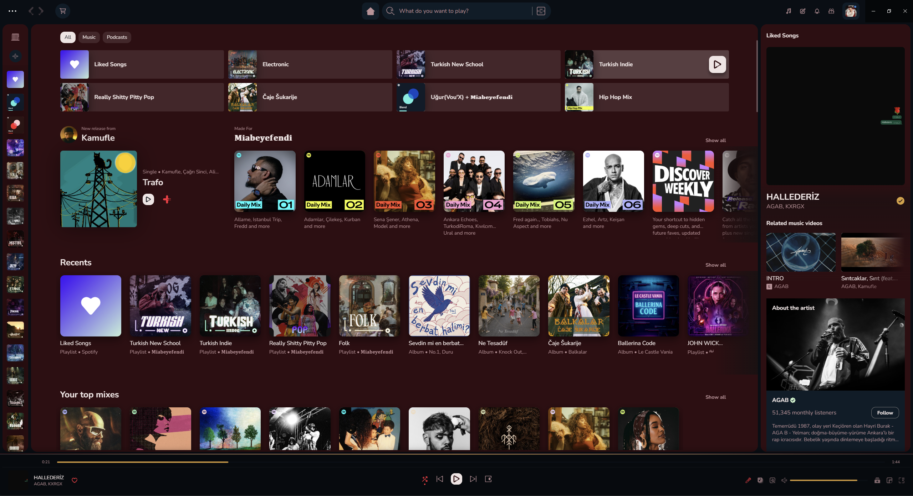<br/>
    <sub><b>Crimson</b> · deep wine surface, warm gold highlights</sub>
  </td>
  <td align="center">
    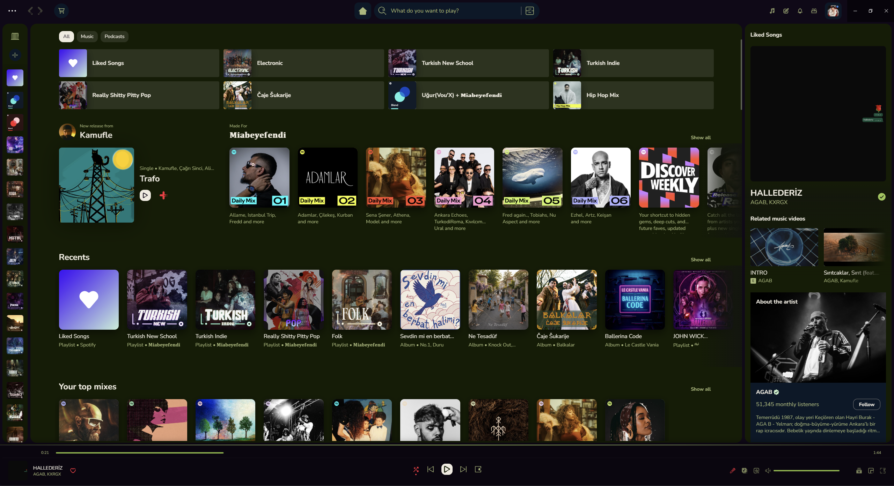<br/>
    <sub><b>Olive</b> · forest moss, lime accent, soft text</sub>
  </td>
</tr>
</table>

> Plus the **Spotify Default** scheme, included so you can A/B the theme against the stock look.

### Light

<table>
<tr>
  <td align="center" width="50%">
    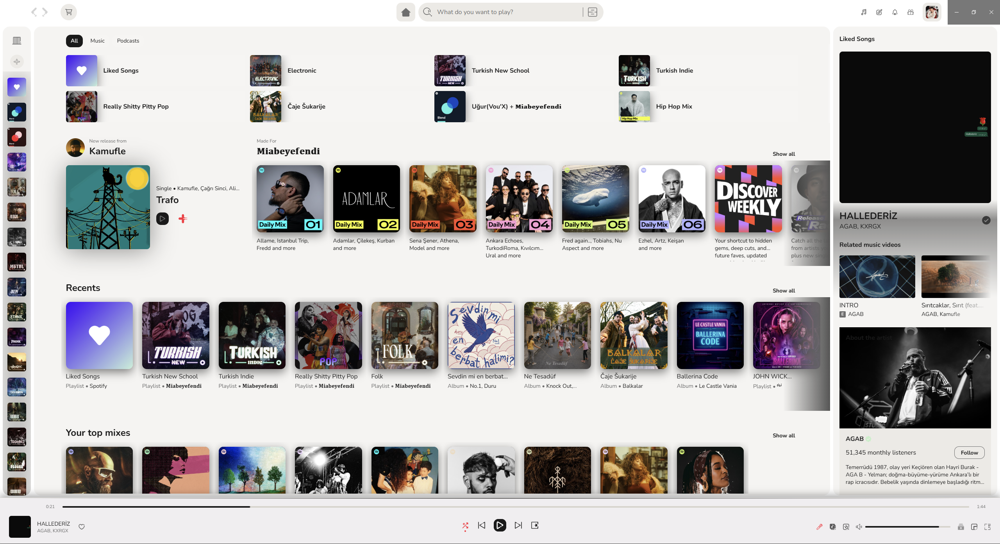<br/>
    <sub><b>VantaWhite</b> · paper-white surfaces, near-black type</sub>
  </td>
  <td align="center" width="50%">
    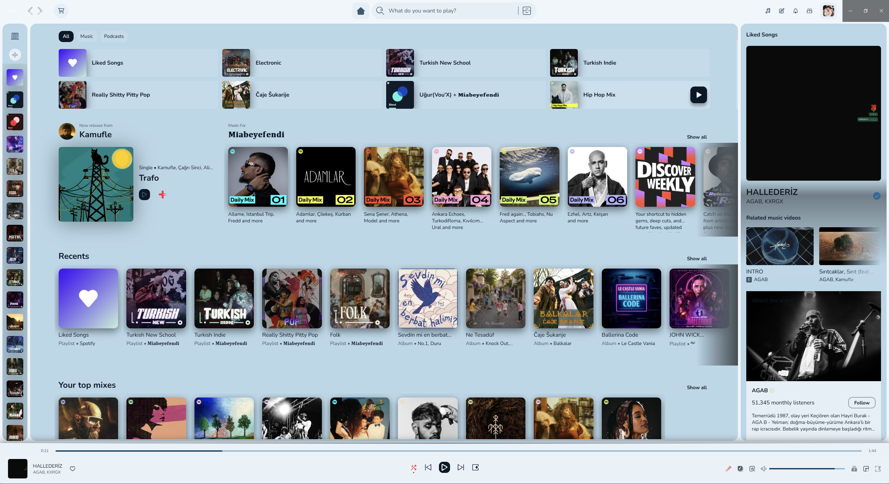<br/>
    <sub><b>Glass</b> · pale blue/teal, frosted feel</sub>
  </td>
</tr>
<tr>
  <td align="center">
    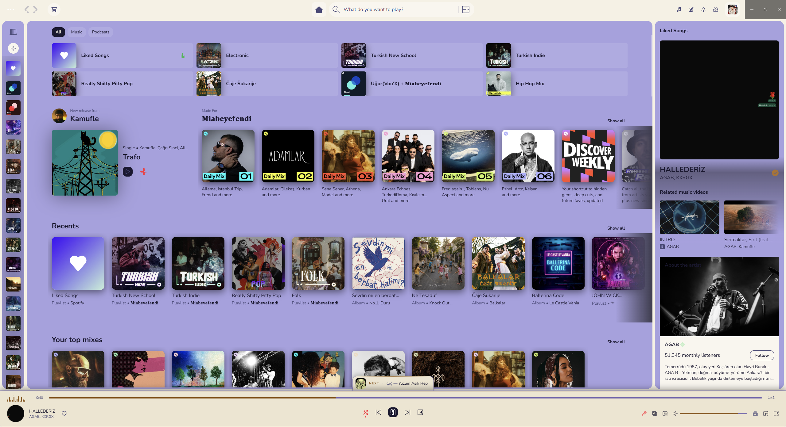<br/>
    <sub><b>Lavender Blush</b> · cream + lavender, warm amber accent</sub>
  </td>
  <td align="center">
    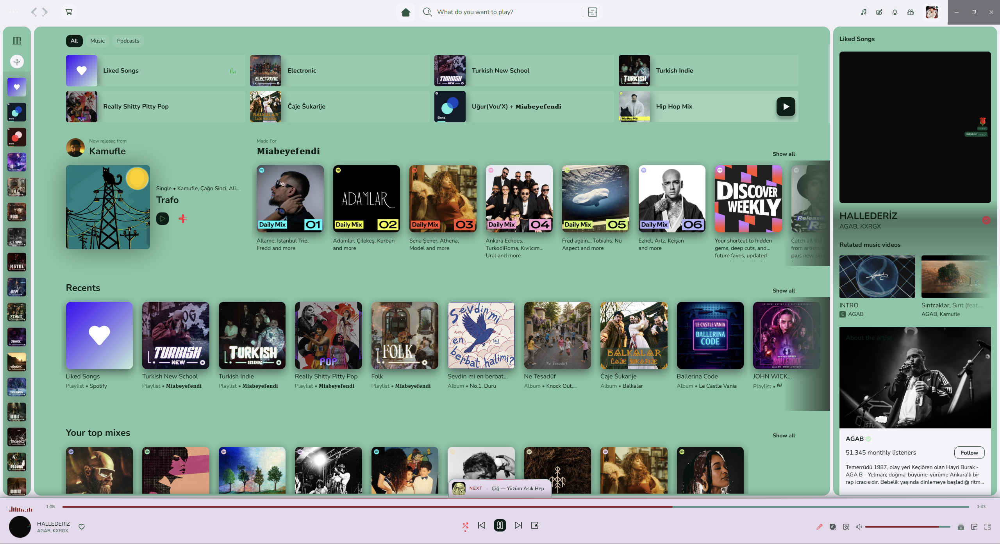<br/>
    <sub><b>Teal Green</b> · soft teal, rose-red accent</sub>
  </td>
</tr>
</table>

> Two more light themes ship in `color.ini` and appear in the picker: **Rose Vale** and **Japanese Indigo**.

---

## 📦 Installation

### Prerequisites

- [Spotify Desktop](https://www.spotify.com/download/) (tested on `1.2.86+`)
- [Spicetify CLI](https://spicetify.app/docs/getting-started) (tested on `2.43+`)

### 1. Copy files to the Spicetify folders

Spicetify keeps themes and extensions in two **separate** folders under your AppData. On Windows the exact paths are:

| What | Where it goes |
|---|---|
| The **`Vantagraph`** folder (with `color.ini`, `user.css`, `theme.js`, `icons/`, `screenshots/`) | `C:\Users\<YOU>\AppData\Roaming\spicetify\Themes\Vantagraph\` |
| Every `.js` file inside **`Vantagraph/Extensions/`** | `C:\Users\<YOU>\AppData\Roaming\spicetify\Extensions\` |

You can open either folder fast with `spicetify config-dir`.

The final layout should look like this:

```
%AppData%\spicetify\
├─ Themes\
│  └─ Vantagraph\
│     ├─ color.ini
│     ├─ user.css
│     ├─ theme.js
│     ├─ icons\
│     └─ screenshots\
└─ Extensions\
   ├─ vantagraph-settings.js          ← required
   ├─ vantagraph-icons.js             ← preferred
   ├─ vantagraph-lyric-miniplayer.js  ← optional (recommended)
   ├─ vantagraph-loopyloop.js         ← optional (recommended)
   ├─ vantagraph-taskbarplayer.js     ← optional (recommended)
   ├─ vantagraph-volume-plus.js       ← optional (recommended)
   └─ vantagraph-debug.js             ← developers only
```

### 2. Pick what to enable

The extensions fall into four tiers. Mix and match freely - every extension is opt-in except `vantagraph-settings.js`.

| Tier | Extension | Why |
|---|---|---|
| **Required** | `vantagraph-settings.js` | Without this, the in-app Settings panel (gear icon) never appears. The theme still works without it but you lose all live configuration. |
| **Preferred** | `vantagraph-icons.js` | Replaces 66 Encore SVGs with the Vantagraph icon set. Strongly recommended for the full visual identity, but the theme itself still looks great if you skip it. |
| **Optional (recommended)** | `vantagraph-lyric-miniplayer.js`<br/>`vantagraph-loopyloop.js`<br/>`vantagraph-taskbarplayer.js`<br/>`vantagraph-volume-plus.js` | Feature add-ons. Enable as many as you want. None of them is required for the theme. |
| **Developers only** | `vantagraph-debug.js` | A DevTools-console helper that prints the 3-layer color-override chain. Do not enable as a normal user. |

### 3. Activate Vantagraph

**A) Full setup (recommended starter):** the exact block from `terminalcodes.txt` - turns on the theme, settings panel, icons, and all four optional extensions:

```bash
spicetify config inject_css 1 replace_colors 1 overwrite_assets 1 inject_theme_js 1
spicetify config current_theme vantagraph
spicetify config extensions vantagraph-settings.js
spicetify config extensions vantagraph-volume-plus.js
spicetify config extensions vantagraph-lyric-miniplayer.js
spicetify config extensions vantagraph-loopyloop.js
spicetify config extensions vantagraph-icons.js
spicetify apply
```

> `vantagraph-taskbarplayer.js` is **bundled but not in the default block** because it opens a separate Picture-in-Picture window and is not what everyone wants. Add it with `spicetify config extensions vantagraph-taskbarplayer.js` and re-apply.

**B) Minimal setup:** theme + settings panel only.

```bash
spicetify config inject_css 1 replace_colors 1 overwrite_assets 1 inject_theme_js 1
spicetify config current_theme vantagraph
spicetify config extensions vantagraph-settings.js
spicetify apply
```

After applying, Spotify restarts with Vantagraph active. A **gear icon** appears at the top right of the topbar; click it to open the settings panel.

### Going back to vanilla Spotify

```bash
spicetify config inject_css 0 replace_colors 0 overwrite_assets 0 inject_theme_js 0
spicetify config current_theme marketplace
spicetify config extensions vantagraph-settings.js-
spicetify config extensions vantagraph-volume-plus.js-
spicetify config extensions vantagraph-lyric-miniplayer.js-
spicetify config extensions vantagraph-loopyloop.js-
spicetify apply
```

The trailing `-` on each extension name is Spicetify's "uninstall" syntax.

---

## ⚙️ Settings Tour

Vantagraph's settings panel opens from the **gear icon** in the topbar and runs entirely in-app. It's a 5-tab modal: Theme, Font, Layout, Background, Snippets.

<div align="center">
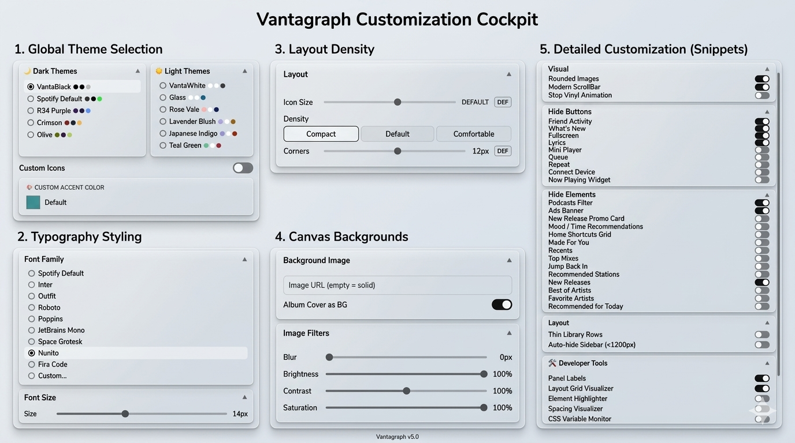
</div>

<table>
<tr>
  <td align="center" width="33%">
    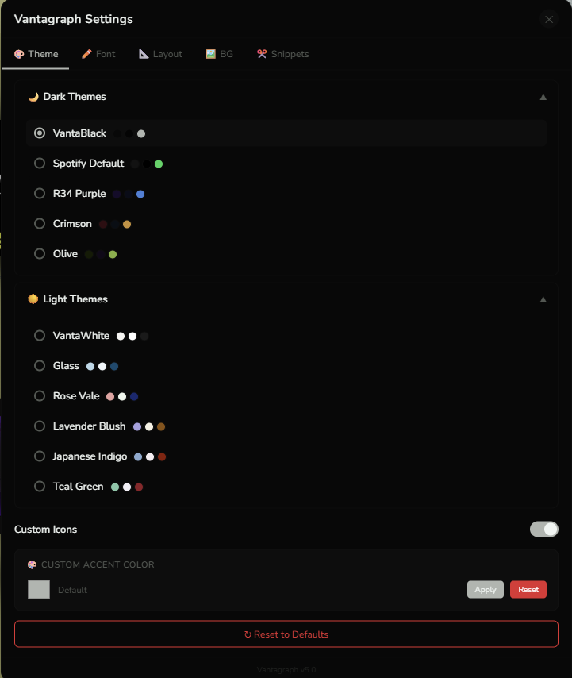<br/>
    <sub><b>🎨 Theme</b><br/>Pick from dark / light groups. Each row shows a 3-swatch preview (panel · window · accent). Below the list: <b>Custom Icons</b> toggle and a <b>Custom Accent</b> color picker (apply / reset).</sub>
  </td>
  <td align="center" width="33%">
    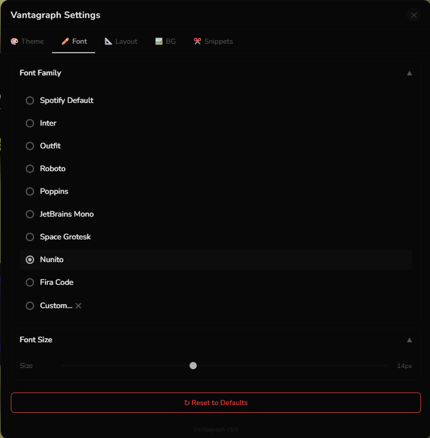<br/>
    <sub><b>✏️ Font</b><br/>Choose a preset (Inter, JetBrains Mono, etc.) or type any Google Fonts family name and Vantagraph builds the URL for you. <b>Size</b> slider goes 10-20px and applies to every Encore type element.</sub>
  </td>
  <td align="center" width="33%">
    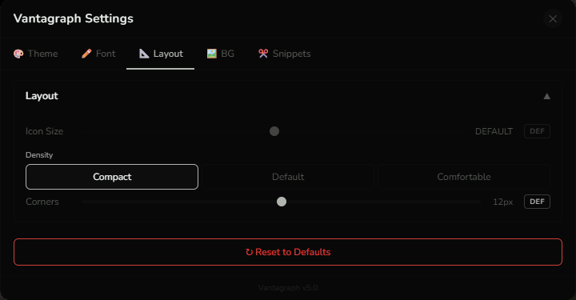<br/>
    <sub><b>📐 Layout</b><br/>Three sliders + a density toggle. <b>Icon Size</b> 12-34px, <b>Density</b> compact / default / comfortable, <b>Corners</b> 0-24px border radius. Each slider has a <b>DEF</b> button that restores native Spotify defaults.</sub>
  </td>
</tr>
<tr>
  <td align="center">
    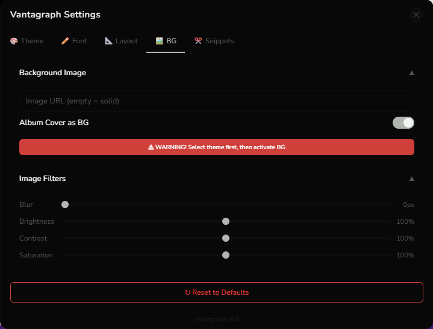<br/>
    <sub><b>🖼️ Background</b><br/>Paste any image URL, or toggle <b>Album Cover as BG</b> to use the currently playing artwork. Image-filter sliders for blur, brightness, contrast, saturation. Tip: select a theme first, then enable the BG.</sub>
  </td>
  <td align="center">
    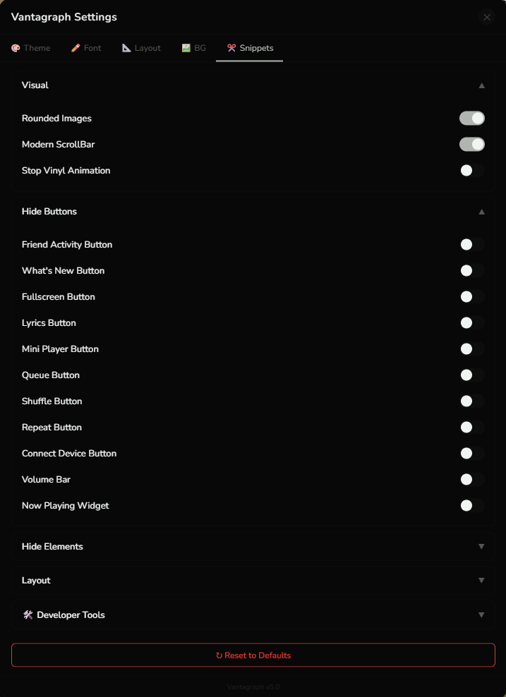<br/>
    <sub><b>✂️ Snippets · Visual & Hide Buttons</b><br/>Rounded images, modern scrollbar, stop vinyl animation. Then a long list of player-bar / topbar toggles: Friend Activity, What's New, Fullscreen, Lyrics, Mini Player, Queue, Shuffle, Repeat, Connect, Volume bar, Now-Playing widget.</sub>
  </td>
  <td align="center">
    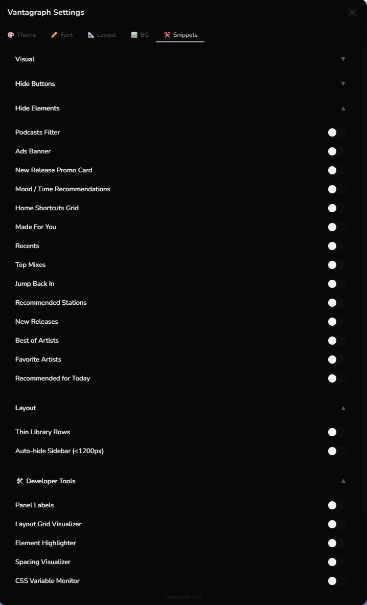<br/>
    <sub><b>✂️ Snippets · Hide Elements, Layout & Dev Tools</b><br/>Hide home sections (Made for You, Top Mixes, Jump Back In, New Releases, etc.), ads banner, podcasts filter. Layout: thin library rows, auto-hide sidebar under 1200px. Dev Tools: layout grid, element highlighter, spacing visualizer, CSS variable monitor, DOM mutation logger, Encore audit.</sub>
  </td>
</tr>
</table>

At the bottom of the panel: a red **↻ Reset to Defaults** button that wipes every `vantagraph:*` localStorage key, removes injected `<style>` and `<link>` tags, clears inline `--spice-*` / `--vg-*` variables on `:root`, drops body classes, and re-applies the Spotify Default theme.

---

## 🧩 Extensions

### Vantagraph Taskbar Player

<div align="center">
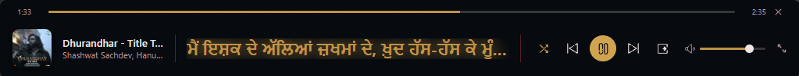
</div>

A borderless, always-on-top mini player built on the experimental `documentPictureInPicture` API. Survives Spotify's SPA navigation wipes via a `MutationObserver` on the PiP `<html>` plus an rAF sentinel. Includes live lyrics, seek, volume, shuffle / repeat / like, and adapts its width when lyrics are toggled off. Optional - enable separately.

### Other extensions bundled

| Extension | What it does |
|---|---|
| `vantagraph-settings.js` | The in-app settings modal (gear icon). Required for the panel to appear. |
| `vantagraph-icons.js` | Replaces 66 Encore SVGs with the Vantagraph icon set. Toggleable from the Theme tab. |
| `vantagraph-volume-plus.js` | Scroll wheel on the volume bar, middle-click mute, percentage tooltip, quick-preset overlay (25/50/75/100%), gold-glow active preset, wide 250px bar. Public-API only (no private `_volume` access). |
| `vantagraph-lyric-miniplayer.js` | PiP lyrics window with word-sync karaoke (rAF loop), 8 animation presets, translations, vinyl, alignment picker, font-size control, like inside header, separate settings popup. |
| `vantagraph-loopyloop.js` | Right-click the progress bar to set loop start / end. Loops persist per track URI in localStorage. Proximity-based scroll-to-nudge for fine adjustments. |
| `vantagraph-taskbarplayer.js` | Borderless, always-on-top floating PiP player (see above). |
| `vantagraph-debug.js` | Console tool that prints, for any CSS variable, the 3-layer override chain: Spotify Encore default → Spicetify `--spice-*` → Vantagraph inline override. Paste into DevTools or load as an extension. |

---

## 🙏 Credits & Inspiration

Three of the bundled extensions are full rewrites built on top of brilliant prior work. Huge thanks to their authors:

### Volume+ inspiration

- **Author:** [Aspecky](https://github.com/Aspecky)
- **Original repo:** <https://github.com/Aspecky/spicetify-extensions/tree/main/volume-plus>
- **Original concept used:** scroll-wheel volume + tooltip.
- **Vantagraph additions:** fully rewritten from scratch with middle-click mute, quick-preset overlay (with gold-glow active indicator and double-click "preferred volume" restore), enforced 250px bar width, Tippy fallback label, Vantagraph icon integration, modern `data-testid` selectors, startup volume restore, first-run middle-click hint, public-API only (no private `_events` / `_volume` access).

### Loopy Loop inspiration

- **Original author:** khanhas (and the [Spicetify](https://github.com/spicetify) maintainers)
- **Original repo:** <https://github.com/spicetify/cli/tree/main/Extensions>
- **Original concept used:** right-click the progress bar to set loop start / end points.
- **Vantagraph additions:** modernized selectors that use the Vantagraph class-mapping system, replaced the deprecated `_HTMLContextMenuItem` API with native `createElement`, Vantagraph-theme-aware colors (`--spice-accent`, `--spice-player`, `--spice-highlight`), per-song loop persistence via localStorage by track URI, proximity-based scroll-to-nudge.

### Lyric Miniplayer inspiration

- **Original author:** FO-SS
- **Original repo:** <https://github.com/FO-SS/Spictify-Lyric-Miniplayer>
- **Original concept used:** floating Picture-in-Picture lyrics window.
- **Vantagraph additions:** live `--spice-*` theming, rAF render loop, `VantagraphData` integration, Spotify-like layout, separate settings popup window, 8 animation presets, translations, vinyl, alignment picker, font-size control, karaoke glow, repeat / like / volume inline.

The visual direction of the README itself is inspired by the showcase styles of [Catppuccin](https://github.com/catppuccin), [Tokyo Night](https://github.com/folke/tokyonight.nvim), [Dracula](https://draculatheme.com/), [Nord](https://www.nordtheme.com/), and [Gruvbox](https://github.com/morhetz/gruvbox). Spotify, the Spotify logo, "Spicetify", and all third-party project names belong to their respective owners; their use here is nominative and implies no affiliation or endorsement.

---

## 🤝 Contributing

Contributions are welcome. Please read [CONTRIBUTING.md](./CONTRIBUTING.md) and [CODE_OF_CONDUCT.md](./CODE_OF_CONDUCT.md) first. By contributing you agree to license your work under the AGPL-3.0.

## 🛡️ Security

Found a vulnerability? Don't open a public issue. Follow the private process in [SECURITY.md](./SECURITY.md).

## 📄 License

Vantagraph is licensed under the **GNU Affero General Public License v3.0 (AGPL-3.0)**, with the supplemental terms in the [LICENSE](./LICENSE) file. In short:

- You may use, study, modify, redistribute, and even monetize this work for free **as long as** you keep the complete source code available under AGPL-3.0 (including for hosted / SaaS / network use - AGPL §13) and preserve the author attribution below.
- For closed-source, proprietary, or non-AGPL use, a **separate written commercial license** is required (which may include royalty / revenue share). See [LICENSE](./LICENSE) §8.

### Required attribution (AGPL §7(b))

The following attribution must be preserved, visibly and unmodified, in every copy, fork, or deployment:

> **Miabeyefendi (Mustafa Ihsan Albayrak)** - <https://github.com/Miabeyefendi>

See [NOTICE](./NOTICE) for the full statement.

## ⚠️ Disclaimer

This software is provided "as is", without warranty of any kind. You run it entirely at your own risk and are solely responsible for your own use, including compliance with the Terms of Service of any third-party platform it interacts with (notably Spotify). Spotify is not affiliated with or endorsing this project; its name and trademarks belong to Spotify AB. The author accepts no liability for account bans, data loss, or any other damages, to the maximum extent permitted by applicable law. Full terms are in the [LICENSE](./LICENSE) file.

## 📬 Contact

- **GitHub:** [@Miabeyefendi](https://github.com/Miabeyefendi)
- **Commercial licensing:** reach me through my GitHub profile.

---

<div align="center">
<sub>Built with ☕ and far too many <code>!important</code> declarations by <a href="https://github.com/Miabeyefendi">Miabeyefendi</a></sub>
</div>
